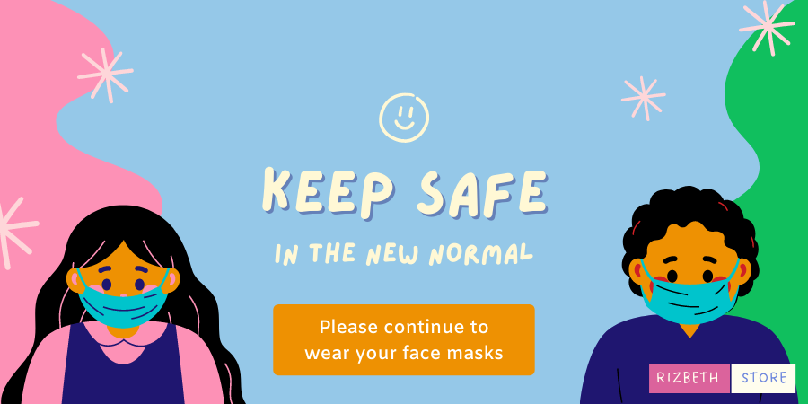

## WASP RADIUS PORTAL
Free Portal for WASP RADIUS

visit https://waspradi.us/ and get 7 Days Free trial for Remote Access and Radius Authentication

## Customize Name and Time
Edit "config.js"

*Don't remove or edit the host "https://waspradi.us"
```javascript
var portalCfg = {
    'portal_name': 'Mendys WiFi',
    'host': 'https://waspradi.us',
    'rates': [
        { "rate_name": "Php", "rate": "5", "time": "4 Hours" },
        { "rate_name": "Php", "rate": "10", "time": "12 Hours" },
    ]
};
```

## Customize Portal Slides
Edit file "login.html",and upload your images in "img" folder
```html
<div class="slideshow-container" align="center">

  <!-- Start of Slide1 -->
  <div class="mySlides fade">
    <div class="numbertext"></div>
    
    <div class="text"></div>
  </div>
  <!-- End of Slide -->

</div>
```

